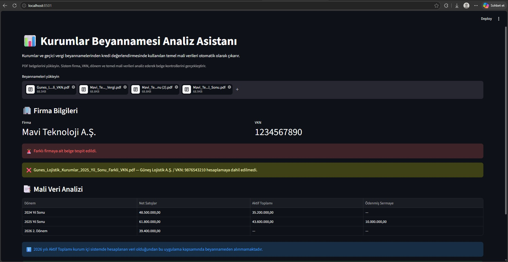
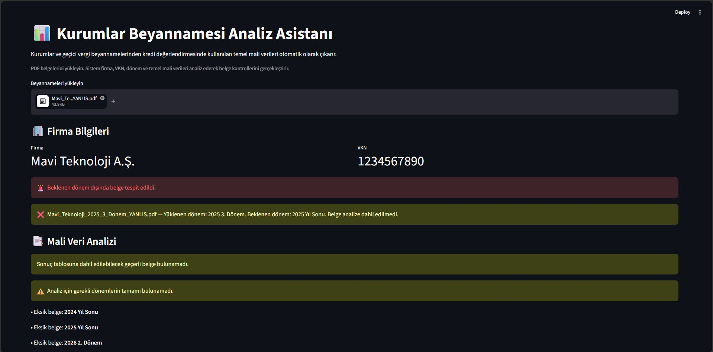

# 📊 Kurumlar Beyannamesi Analiz Asistanı

Kurumlar ve geçici vergi beyannamelerinden kredi değerlendirmesinde kullanılan temel mali verilerin manuel olarak bulunması ve doğru döneme ait belgelerin kontrol edilmesi zaman alan bir süreç olabiliyor.
Bu projeyi, belge inceleme sürecini daha hızlı ve kontrollü hale getirmek amacıyla geliştirdim.

## 🎯 Proje Ne Yapıyor?

Uygulamaya birden fazla beyanname PDF'i yüklenebiliyor.
Sistem belgelerden otomatik olarak:
- Firma adını
- Vergi Kimlik Numarasını (VKN)
- Beyanname dönemini
- Net Satışlar bilgisini
- Aktif Toplamını
- Ödenmiş Sermayeyi
okuyor ve gerekli mali verileri tek bir tabloda gösteriyor.

## 📅 Dönem Bazlı Analiz

Uygulama mevcut iş akışına göre farklı dönemlerden gerekli bilgileri ayırıyor:
- **2024 Yıl Sonu:** Net Satışlar ve Aktif Toplamı
- **2025 Yıl Sonu:** Net Satışlar, Aktif Toplamı ve Ödenmiş Sermaye
- **2026 2. Dönem:** Net Satışlar
2026 yılı Aktif Toplamı kurum içi sistemde hesaplanan bir veri olduğundan uygulama kapsamında beyannameden alınmamaktadır.

## 🔍 Belge Kontrolleri

Uygulama yalnızca mali verileri çıkarmakla kalmıyor, yüklenen belgelerin uygunluğunu da kontrol ediyor.
- Farklı VKN'ye sahip başka bir firmaya ait belgeyi tespit eder.
- Farklı firmaya ait belgeyi analize dahil etmez.
- Beklenen dönem dışında yüklenen beyannameleri tespit eder.
- Yanlış döneme ait belgeleri analize dahil etmez.
- Aynı döneme ait birden fazla belge yüklenirse mükerrer dönem uyarısı verir.
- Gerekli dönemlerden biri eksikse kullanıcıyı uyarır.
- Okunamayan veya gerekli bilgileri bulunamayan belgeleri bildirir.

## 🛠️ Kullanılan Teknolojiler
- Python
- Streamlit
- PyMuPDF
- Pandas
- Regular Expressions (Regex)

## 💡 Örnek Senaryo
Sisteme;
- 2024 Yıl Sonu Kurumlar Vergisi Beyannamesi
- 2025 Yıl Sonu Kurumlar Vergisi Beyannamesi
- 2026 2. Dönem Geçici Vergi Beyannamesi
yüklendiğinde uygulama belgelerin firma ve dönem kontrollerini gerçekleştirir ve gerekli mali verileri otomatik olarak çıkarır.
Yanlış döneme veya farklı bir firmaya ait belge yüklenirse bu belge tespit edilir ve sonuç tablosuna dahil edilmez.

## 🖥️ Uygulama Ekranları

### Mali Veriler Analiz Sonucu

### Belge Kontrol Uyarıları

## 🎥 Proje Videosu

Uygulamanın çalışma mantığını ve farklı belge kontrol senaryolarını uygulamalı olarak anlattığım videoyu YouTube'da izleyebilirsiniz.

https://www.youtube.com/watch?v=GaczxupWaOI
